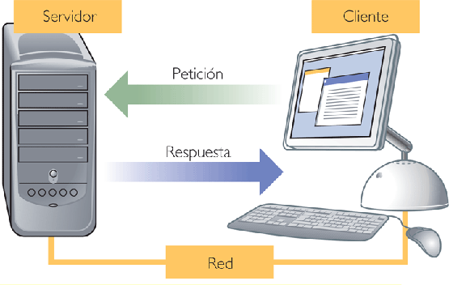

##### EJEMPLO-02
## INICIALIZANDO LA BASE DE DATOS EN MARIADB

### OBJETIVO
Conocer el procedimiento en un servidor MySQL para inicializar la base de datos haciendo uso de contenedores.

#### REQUISITOS
1. Contar con Docker instalado
2. Haber actualizado el contenido de la carpeta `CursoPythonBedu`
3. Abrir una terminal o consola de comandos y cambiarse a la carpeta de trabajo `CursoPythonBedu/Clase-05/Ejemplo-02` y observar que exista el archivo `biblioteca.sql`

   ```sh
   $ cd Clase-05/Ejemplo-02

   Clase-05/Ejemplo-02 $ ls
   biblioteca.sql  Readme.md

   Clase-05/Ejemplo-02 $
   ```
   ***

### DESARROLLO
1. Para poder hacer uso del servidor MariaDB por medio de Docker, lo primero que hay que hacer es descargar un archivo llamado imagen que contiene ya instalado MariaDB y usaremos la versión 10.3 por lo que usaramos el siguiente comando:

   __Resultado__

   ```sh
   Clase-05/Ejemplo-02 $ docker pull mariadb:10.3
   10.3: Pulling from library/mariadb
   6abc03819f3e: Pull complete
   05731e63f211: Pull complete
   0bd67c50d6be: Pull complete
   ab62701212b1: Pull complete
   b1f6f41348ef: Pull complete
   3bdaf925d088: Pull complete
   10ba8f10417b: Pull complete
   3806bed5c691: Pull complete
   24aae6d0fc18: Pull complete
   9104943e23ec: Pull complete
   ae510462589d: Downloading  71.32MB/74.34MB
   ec23646ae61e: Download complete
   3c301b916a4e: Download complete
   Digest: sha256:db6e7bda67ea88efb00ba4ad82cb72dfee8938935914ae0948f6af523d398ca2
   Status: Downloaded newer image for mariadb:10.3

   Clase-05/Ejemplo-02 $  
   ```
   ***

2. Responder a la pregunta ¿Qué es SQL?

   __Resultado__
   ```sql
   CREATE TABLE Autor(
      idAutor integer primary key autoincrement,
      nombre text,
      apPaterno text,
      apMaterno text
   );
   ```
   ***

3. Responder a la pregunta ¿Qué es la arquitectura Cliente-Servidor?

   __Resultado__

   
   1. El Servidor presenta a todos los Clientes una interfaz única y bien definida.
   2. El Cliente no necesita saber la lógica y el funcionamiento del Servidor.
   3. El Cliente no depende de nada del Servidor, ni su ubicación, ni su tipo de equipo, ni su sistema operativo.
   4. Los cambios en el Servidor implican pocos o ningún cambio a los Clientes.
   5. Un Servidor puede atender a uno o más Clientes
   ***

4. Iniciando un servidor de MariaDB 10.3 creando un contenedor de Docker llamado __pythonsql__ (--name) y asignando una clave __pythonsql__ (MYSQL_ROOT_PASSWORD) al usuario __root__

   __Resultado__

   ```sh
   Clase-05/Ejemplo-02 $ docker run --name pythonsql -e MYSQL_ROOT_PASSWORD=pythonsql -d mariadb:10.3
   Unable to find image 'mariadb:10.3' locally
   10.3: Pulling from library/mariadb
   Digest: sha256:182b47379bf7...
   Status: Downloaded newer image for mariadb:10.3
   2744f516cda94c5b60...

   Clase-05/Ejemplo-02 $
   ```
   ***

5. Se consiguen los datos para conectarse al servidor MariaDB:
   - __Host:__ localhost (?)
   - __User:__ root
   - __Pass:__ pythonsql

   La conexión se realiza mediante el comando `mysql` de la siguiente manera:
   ```sh
   mysql -hlocalhost -uroot -ppythonsql
   ```
   sólo que el comando `mysql` no está instalado en nuestro sistema operativo, así que haremos uso de la imagen descargada de MariaDB.

6. Para inicializar la base de datos se ejecuta el comando `mysql` pero desde el contenedor de Docker con el siguiente comando:
   ```sh
   Clase-05/Ejemplo-02 $ docker exec -i pythonsql mysql -hlocalhost -uroot -ppythonsql < biblioteca.sql

   Clase-05/Ejemplo-02 $
   ```

   Como en apariencia no ha sucedido nada, en el siguiente paso se valida la correcta ejecución.
   ***
7. Para validar que la base de datos se haya inicializado de forma correcta se realiza una conexión a la base de datos Biblioteca usando los datos:

   - __Host:__ localhost
   - __User:__ Biblioteca
   - __Pass:__ Biblioteca
   - __Base de datos:__ Biblioteca

  ```sh
  Clase-05/Ejemplo-02 $ docker exec -it pythonsql mysql -hlocalhost -uBiblioteca -p Biblioteca
  Enter password:
  Welcome to the MariaDB monitor.  Commands end with ; or \g.
  Your MariaDB connection id is 9
  Server version: 10.3.15-MariaDB-1:10.3.15+maria~bionic mariadb.org binary distribution

  Copyright (c) 2000, 2018, Oracle, MariaDB Corporation Ab and others.

  Type 'help;' or '\h' for help. Type '\c' to clear the current input statement.

  MariaDB [Biblioteca]> SHOW TABLES;
  Empty set (0.000 sec)

  MariaDB [Biblioteca]> EXIT;

  Clase-05/Ejemplo-02 $
  ```
  ***

Si has llegado hasta este punto __FELICIDADES__, toma un respiro o ayuda a algún compañero que no lo haya logrado aún o tomate una selfi con tu primer contenedor de Docker ejecutando un servidor de base de datos MariaDB.
<span style="display:block;text-align:center;"></span>
