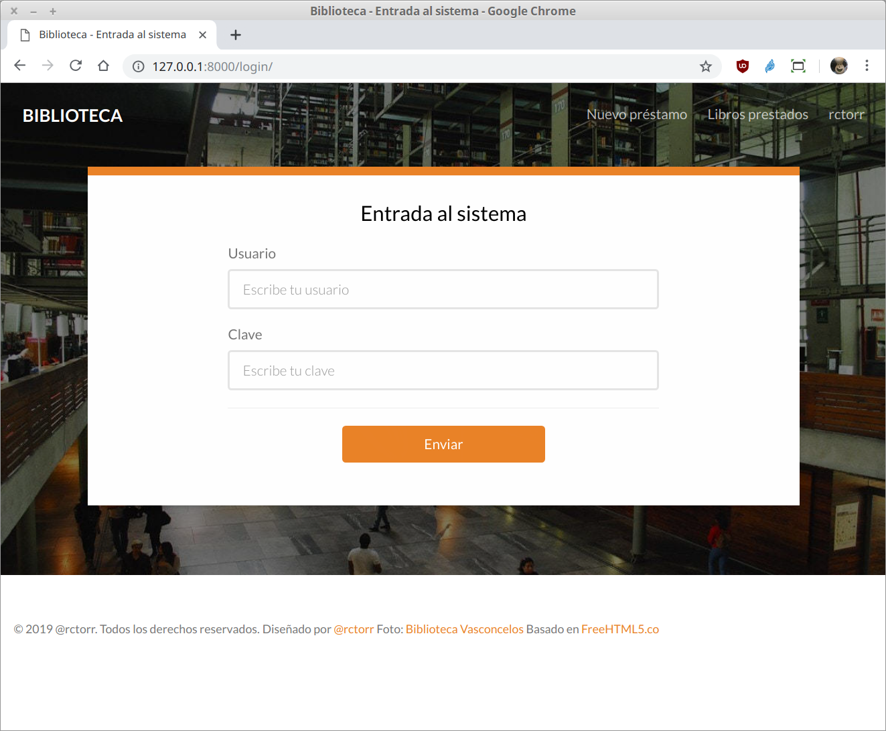

`Fullstack con Python` > [`Backend con Python`](../../Readme.md) > [`Sesión 09`](../Readme.md) > Proyecto
## Definiendo y agregando una página con formulario a la aplicación web

### OBJETIVO
- Crear la ruta y vista para generar el formulario de login
- Crear la ruta y vista para procesar la información de un formulario vía POST.

### REQUISITOS
1. Actualizar repositorio
1. Usar la carpeta de trabajo `Clase-09/Proyecto`
1. Diagrama del modelo entidad-relación para el proyect __Biblioteca__

   


### DESARROLLO
Dada la url `http://localhost/login/` se deberá mostrar las siguiente página para hacer __login__ al sistema:



Y posteriormente al proporcionar el usuario __biblioteca__ y clave __biblioteca__ deberá mostrar la página de inicio o un mensaje de error en caso de que no se proporciones los datos de forma correcta.

1. Crear la ruta para la url `/login/`

   __Se modifica el archivo `Biblioteca/catalogo/urls.py` agregando la línea siguiente:__

   ```python
   path("login/", views.login, name="login"),
   ```
   ***

1. Crear la vista `views.login`

   __Se modifica el archivo `Biblioteca/catalogo/views.py` agregando las función login():__

   ```python
   def login(request):
       """ Atiende las peticiones de GET /login/ """

       msg = ""

       return render(request, "registration/login.html",
           {
               "msg":msg,
           }
       )
   ```
   ***

1. Crear la plantilla `login.html`

   __Se crea el archivo `Biblioteca/catalogo/templates/catalogo/registration/login.html` con el siguiente contenido:__

   ```html
   

   Entrada al sistema

   
   <div class="row animate-box">
     <div class="col-md-8 col-md-offset-2">
       <h3 class="text-black text-center">Entrada al sistema</h3>
       <form method="POST">
           
           <aside class="form-group">
               <label for="usuario">Usuario</label>
               <input type="text" id="usuario" class="form-control" required placeholder="Escribe tu usuario" name="username" />
           </aside>
           <aside class="form-group">
               <label for="clave">Clave</label>
               <input type="password" id="clave" class="form-control" required placeholder="Escribe tu clave" name="password" />
           </aside>
           <hr />
           <aside class="form-group">
             <div class="row">
               <div class="col-md-6 col-md-offset-3">
                   <input class="btn btn-primary btn-block" type="submit" name="submit" value="Enviar" />
               </div>
             </div>
           </aside>
           <input type="hidden" name="next" value="{{ next }}" />
           
           <aside class="alert alert-dismissible alert-danger">
               {{ msg }}
           </aside>
           
       </form>
     </div>
   </div>
   
   ```

   Finalmente se obtiene el formulario esperado!
   ***

1. Ajustar la vista `views.login` para que valide los datos del formulario.

   __Se procesan los datos POST en la vista:__

   ```python
   # Se definen los datos de un usuario válido
   usuario_valido = ("biblioteca", "biblioteca")  # (username, password)

   # Si hay datos vía POST se procesan
   if request.method == "POST":
       # Se obtienen los datos del formulario
       usuario_form = (request.POST["username"],
           request.POST["password"])
       if usuario_form == usuario_valido:
           # Tenemos usuario válido, redireccionamos a index
           return redirect("/")
       else:
           # Usuario malo
           msg = "Datos incorrectos, intente de nuevo!"
   else:
       # Si no hay datos POST
       msg = ""
   ```
   Y así se debería de ver cuando el usuario es incorrecto:
      
   ***
