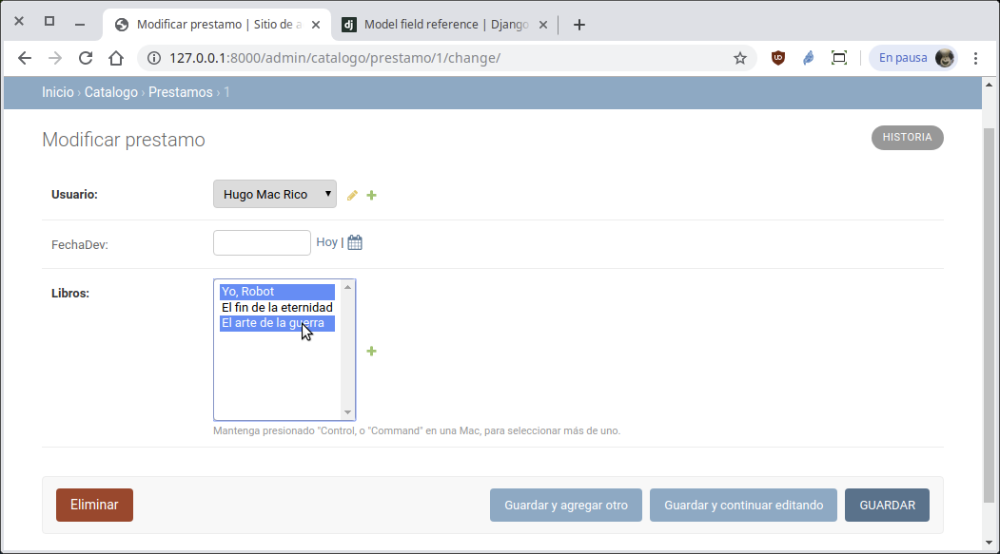

`Fullstack con Python` > [`Backend con Python`](../../Readme.md) > [`Sesión 09`](../Readme.md) > Reto-02
## Creando relaciones muchos a muchos con el modelo de datos de Django.

### OBJETIVO
- Crear una relación muchos a muchos entre dos tablas.

### REQUISITOS
1. Actualizar repositorio
1. Usar la carpeta de trabajo `Clase-09/Reto-02`
1. Diagrama del modelo entidad-relación para el proyect __Biblioteca__

   

1. Documentación de Django referente a modelos:
   - Descripción de modelos y ejemplos: https://docs.djangoproject.com/en/2.2/topics/db/models/
   - Referencia a la API de Modelos en Django https://docs.djangoproject.com/en/2.2/ref/models/
   - Referencia a los tipos de datos que maneja Django https://docs.djangoproject.com/en/2.2/ref/models/fields/#field-types

### DESARROLLO
1. Usando el modelo entidad-relación, modificar la tabla Prestamo para agregar la relación muchos a muchos con la tabla Libro:

   __TIP:__ Revisar el tipo de dato ManyToManyField()__
   https://docs.djangoproject.com/en/2.2/ref/models/fields/#manytomanyfield

   ```python
   class Prestamo(models.Model):
       """ Define la tabla Prestamo """
       usuario = models.ForeignKey(Usuario, on_delete=models.CASCADE)
       fechaPre = models.DateField(auto_now_add=True)
       fechaDev = models.DateField(null=True, blank=True)
       ???

       def __str__(self):
           """ Se define la representación en str para Prestamo """
           return str(self.id)
   ```

   __Avisando a Django que hemos modificado el archivo `models.py`:__

   ```console
   (Biblioteca) Reto-02/Biblioteca $ python manage.py makemigrations
   (Biblioteca) Reto-02/Biblioteca $ python manage.py migrate
   (Biblioteca) Reto-02/Biblioteca $
   ```

   Al modificar un préstamos en el administrador de Django se verá algo similar a lo siguiente:

   

   Donde se puede asignar uno, dos o más libros a este préstamo.
   ***
